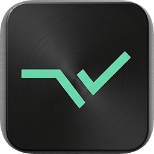

# /markd.

### Save any web page to a personal library — organized, searchable, synced.

One click to capture. Folders to organize. A code to share. 
Your saves follow you to every device — no setup, nothing to maintain.

 

 

&nbsp;

---

## Why /markd.

Bookmarks pile up and you never find them again. Tabs sit open for weeks. **/markd.** turns *"save it for later"* into something you actually use: capture any page in a click, drop it into a folder, and find or share the whole set in seconds — across all your devices.

## Features

|   |   |
|---|---|
| ⚡ **One-click capture** | Save the current page with the button, or **Alt + M** / **⌥ + M**. |
| 🗂️ **Folders & subfolders** | Group related pages so you never dig for them again. |
| 🔎 **Instant search** | Find a save *or* a folder by name, title, or site. |
| 🔗 **Share by code** | Send a single save or a whole folder with one short, one-time code. |
| ☁️ **Cross-device sync** | Sign in with email — your library is there on every computer. |
| 🔒 **Private by default** | Every account sees only its own library. |

<!--
  SCREENSHOTS / GIFS GO HERE.
  Drop images into assets/ (e.g. assets/shot-popup.png, assets/shot-folders.png)
  and add a section below, e.g.:
  ## See it in action
  

-->

---

## Install — Chrome / Edge / Brave

1. Download **[markd-chrome.zip](downloads/markd-chrome.zip)**
2. Unzip to a folder (e.g. `markd-chrome`)
3. Open `chrome://extensions`
4. Turn on **Developer mode** (top right)
5. Click **Load unpacked** → choose the unzipped folder
6. Pin **/markd.** to your toolbar

> One build works across all Chromium browsers — **Chrome, Edge, Brave, Opera, Arc, Vivaldi**. Use the Chrome ZIP.

## Install — Firefox

1. Download **[markd-firefox.zip](downloads/markd-firefox.zip)**
2. Unzip
3. Open `about:debugging#/runtime/this-firefox`
4. Click **Load Temporary Add-on…** → pick `manifest.json` inside the folder

> Temporary add-ons unload when Firefox restarts. A permanent AMO listing is coming.

---

## Sign in

1. Click the **/markd.** icon
2. Tap **Sign in** (or the **person** icon)
3. Enter your email → **Send code**
4. Paste the **6-digit code** from your inbox → **Verify**

Sign in with the same email on any computer and your whole library is right there.

## Quick reference

| Action | How |
|--------|-----|
| Save the current page | **Capture** in the popup, or **⌥ + M** (Mac) / **Alt + M** (Windows) |
| Browse your saves | **Recents · Web · Folders** tabs |
| Search | Type in the **search bar** — matches folders *and* saves |
| Make a folder | **Folders** tab → **+** |
| Move a save into a folder | Right-click a save → **Move to** |
| Share | Right-click a save or folder → **Share** → send the code |
| Import a share | Paste the code in the box → **↵** |

---

## What you can actually do with it

Saving a page is the easy part. **Folders** are where /markd. earns its place — group related pages so you never have to dig for them again.

- **Collect scattered posts.** A great LinkedIn post, a thread, a tip — you can't bookmark your way back through an endless feed. Capture each into a **"LinkedIn"** folder and they're all in one place.
- **Job hunt.** Save every posting into a **"Jobs"** folder, then **share the whole folder** with a mentor in one code.
- **Research a topic.** Pull articles, docs, and references into one folder — your own reading desk.
- **Plan a trip.** Hotels, things to do, restaurants → a **"Trip to Tokyo"** folder you can share with whoever's coming.
- **Recipes.** Save them from any site into **"Recipes"** instead of 30 tabs you'll never reopen.
- **Shopping / gift ideas.** Drop product pages into a **"Wishlist"** and share it so people know what to get you.
- **Study group.** Build a folder of tutorials, share one code, everyone imports the same set instantly.
- **Read later.** Long reads go into **"Read later"** — open them on your phone, laptop, anywhere you're signed in.

The pattern is always the same: **save → drop into a folder → find it instantly → share the whole set when you want.**

---

## Privacy

- Saves are tied to **your** email account
- Each person only ever sees their own library
- Share codes are short-lived and one-time

## Coming soon

- **A side panel** — your library open right next to whatever you're reading, browse and organize without leaving the page.
- **AI built in** — strip the ads, menus, and clutter from any saved page and keep just the clean, readable content, then search your whole library by *what it's about*, not just the title.

---

**Questions or ideas?** [Open an issue](https://github.com/MrFixer-02/markd-popup/issues)

MIT License — see [LICENSE](LICENSE)

